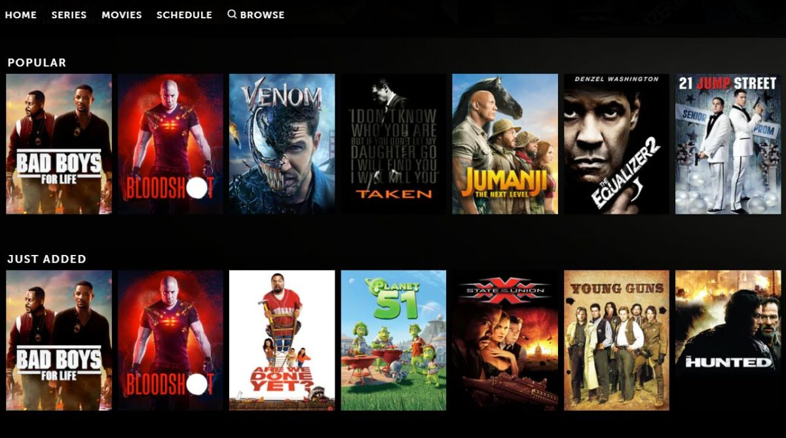

# Movie Recommender System



This is a simple movie recommender system built using Python and Streamlit. The recommender system suggests similar movies to the user based on the movie they select from the dropdown menu. The similarity between movies is calculated using cosine similarity.

## Data

>- [Link to Datasets](https://grouplens.org/datasets/movielens/latest/)

The data used for building this system is taken from two CSV files - movies.csv and ratings.csv. The movies.csv file contains information about movies, such as movie ID, title, and genre. The ratings.csv file contains movie ratings provided by different users.

## How it Works

The recommender system works by first merging the movies and ratings data. Then, it creates a pivot table using the userId, title, and rating columns. The pivot table is filled with 0 values for NaN values.

Next, the system calculates the cosine similarity between movies using the pivot table. The cosine similarity is a measure of similarity between two non-zero vectors of an inner product space that measures the cosine of the angle between them. The higher the cosine similarity between two movies, the more similar they are.

A function is defined to get the top 10 similar movies to the selected movie. The function takes the selected movie, cosine similarity matrix, and pivot table as inputs. It then returns the indices of the top 10 similar movies, which are then used to display the titles of those movies.

## Requirements
This project requires the following Python libraries to be installed:

```streamlit``` <br>
```pandas``` <br>
```Pillow``` <br> 
```scikit-learn``` <br>

## How to Run

To run the recommender system, navigate to the project directory in the command prompt and type ```streamlit run app.py```. This will start the Streamlit app in your default browser.